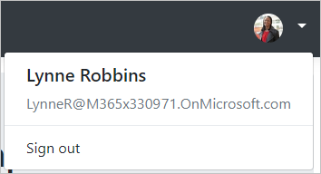

<!-- markdownlint-disable MD002 MD041 -->

<span data-ttu-id="00c8d-101">In dieser Übung erweitern Sie die Anwendung aus der vorherigen Übung, um die Authentifizierung mit Azure AD zu unterstützen.</span><span class="sxs-lookup"><span data-stu-id="00c8d-101">In this exercise you will extend the application from the previous exercise to support authentication with Azure AD.</span></span> <span data-ttu-id="00c8d-102">Dies ist notwendig, um das erforderliche OAuth-Zugriffstoken zum Aufruf der Microsoft Graph-API abzurufen.</span><span class="sxs-lookup"><span data-stu-id="00c8d-102">This is required to obtain the necessary OAuth access token to call the Microsoft Graph API.</span></span> <span data-ttu-id="00c8d-103">In diesem Schritt wird die [Microsoft. Identity.](https://www.nuget.org/packages/Microsoft.Identity.Web/) webbibliothek konfiguriert.</span><span class="sxs-lookup"><span data-stu-id="00c8d-103">In this step you will configure the [Microsoft.Identity.Web](https://www.nuget.org/packages/Microsoft.Identity.Web/) library.</span></span>

> [!IMPORTANT]
> <span data-ttu-id="00c8d-104">Um zu vermeiden, dass die Anwendungs-ID und der geheime Schlüssel in der Quelle gespeichert werden, verwenden Sie den [.net Secret Manager](/aspnet/core/security/app-secrets) zum Speichern dieser Werte.</span><span class="sxs-lookup"><span data-stu-id="00c8d-104">To avoid storing the application ID and secret in source, you will use the [.NET Secret Manager](/aspnet/core/security/app-secrets) to store these values.</span></span> <span data-ttu-id="00c8d-105">Der geheime Manager dient nur Entwicklungszwecken, für Produktions-apps sollte ein vertrauenswürdiger geheimer geheim Manager zum Speichern von Geheimnissen verwendet werden.</span><span class="sxs-lookup"><span data-stu-id="00c8d-105">The Secret Manager is for development purposes only, production apps should use a trusted secret manager for storing secrets.</span></span>

1. <span data-ttu-id="00c8d-106">Öffnen Sie **./appsettings.jsauf** , und ersetzen Sie den Inhalt durch Folgendes.</span><span class="sxs-lookup"><span data-stu-id="00c8d-106">Open **./appsettings.json** and replace its contents with the following.</span></span>

    :::code language="json" source="../demo/GraphTutorial/appsettings.json" highlight="2-6":::

1. <span data-ttu-id="00c8d-107">Öffnen Sie die CLI in dem Verzeichnis, in dem sich **GraphTutorial. csproj** befindet, und führen Sie die folgenden Befehle aus, indem `YOUR_APP_ID` Sie Ihre Anwendungs-ID aus dem Azure-Portal und den `YOUR_APP_SECRET` geheimen Anwendungsschlüssel ersetzen.</span><span class="sxs-lookup"><span data-stu-id="00c8d-107">Open your CLI in the directory where **GraphTutorial.csproj** is located, and run the following commands, substituting `YOUR_APP_ID` with your application ID from the Azure portal, and `YOUR_APP_SECRET` with your application secret.</span></span>

    ```Shell
    dotnet user-secrets init
    dotnet user-secrets set "AzureAd:ClientId" "YOUR_APP_ID"
    dotnet user-secrets set "AzureAd:ClientSecret" "YOUR_APP_SECRET"
    ```

## <a name="implement-sign-in"></a><span data-ttu-id="00c8d-108">Implementieren der Anmeldung</span><span class="sxs-lookup"><span data-stu-id="00c8d-108">Implement sign-in</span></span>

<span data-ttu-id="00c8d-109">Beginnen Sie mit dem Hinzufügen der Microsoft Identity Platform-Dienste zur Anwendung.</span><span class="sxs-lookup"><span data-stu-id="00c8d-109">Start by adding the Microsoft Identity platform services to the application.</span></span>

1. <span data-ttu-id="00c8d-110">Erstellen Sie eine neue Datei mit dem Namen **GraphConstants.cs** im Verzeichnis **./Graph** , und fügen Sie den folgenden Code hinzu.</span><span class="sxs-lookup"><span data-stu-id="00c8d-110">Create a new file named **GraphConstants.cs** in the **./Graph** directory and add the following code.</span></span>

    :::code language="csharp" source="../demo/GraphTutorial/Graph/GraphConstants.cs" id="GraphConstantsSnippet":::

1. <span data-ttu-id="00c8d-111">Öffnen Sie die Datei **./Startup.cs** , und fügen Sie die folgenden `using` Anweisungen am Anfang der Datei hinzu.</span><span class="sxs-lookup"><span data-stu-id="00c8d-111">Open the **./Startup.cs** file and add the following `using` statements to the top of the file.</span></span>

    ```csharp
    using Microsoft.AspNetCore.Authentication.OpenIdConnect;
    using Microsoft.AspNetCore.Authorization;
    using Microsoft.AspNetCore.Mvc.Authorization;
    using Microsoft.Identity.Web;
    using Microsoft.Identity.Web.UI;
    using Microsoft.IdentityModel.Protocols.OpenIdConnect;
    using Microsoft.Graph;
    using System.Net;
    using System.Net.Http.Headers;
    ```

1. <span data-ttu-id="00c8d-112">Ersetzen Sie die vorhandene `ConfigureServices`-Funktion durch Folgendes.</span><span class="sxs-lookup"><span data-stu-id="00c8d-112">Replace the existing `ConfigureServices` function with the following.</span></span>

    ```csharp
    public void ConfigureServices(IServiceCollection services)
    {
        services
            // Use OpenId authentication
            .AddAuthentication(OpenIdConnectDefaults.AuthenticationScheme)
            // Specify this is a web app and needs auth code flow
            .AddMicrosoftIdentityWebApp(Configuration)
            // Add ability to call web API (Graph)
            // and get access tokens
            .EnableTokenAcquisitionToCallDownstreamApi(options => {
                Configuration.Bind("AzureAd", options);
            }, GraphConstants.Scopes)
            // Use in-memory token cache
            // See https://github.com/AzureAD/microsoft-identity-web/wiki/token-cache-serialization
            .AddInMemoryTokenCaches();

        // Require authentication
        services.AddControllersWithViews(options =>
        {
            var policy = new AuthorizationPolicyBuilder()
                .RequireAuthenticatedUser()
                .Build();
            options.Filters.Add(new AuthorizeFilter(policy));
        })
        // Add the Microsoft Identity UI pages for signin/out
        .AddMicrosoftIdentityUI();
    }
    ```

1. <span data-ttu-id="00c8d-113">`Configure`Fügen Sie in der-Funktion die folgende Linie oberhalb der `app.UseAuthorization();` Linie hinzu.</span><span class="sxs-lookup"><span data-stu-id="00c8d-113">In the `Configure` function, add the following line above the `app.UseAuthorization();` line.</span></span>

    ```csharp
    app.UseAuthentication();
    ```

1. <span data-ttu-id="00c8d-114">Öffnen Sie **./Controllers/HomeController.cs** , und ersetzen Sie den Inhalt durch Folgendes.</span><span class="sxs-lookup"><span data-stu-id="00c8d-114">Open **./Controllers/HomeController.cs** and replace its contents with the following.</span></span>

    ```csharp
    using GraphTutorial.Models;
    using Microsoft.AspNetCore.Authorization;
    using Microsoft.AspNetCore.Mvc;
    using Microsoft.Extensions.Logging;
    using Microsoft.Identity.Web;
    using System.Diagnostics;
    using System.Threading.Tasks;

    namespace GraphTutorial.Controllers
    {
        public class HomeController : Controller
        {
            ITokenAcquisition _tokenAcquisition;
            private readonly ILogger<HomeController> _logger;

            // Get the ITokenAcquisition interface via
            // dependency injection
            public HomeController(
                ITokenAcquisition tokenAcquisition,
                ILogger<HomeController> logger)
            {
                _tokenAcquisition = tokenAcquisition;
                _logger = logger;
            }

            public async Task<IActionResult> Index()
            {
                // TEMPORARY
                // Get the token and display it
                try
                {
                    string token = await _tokenAcquisition
                        .GetAccessTokenForUserAsync(GraphConstants.Scopes);
                    return View().WithInfo("Token acquired", token);
                }
                catch (MicrosoftIdentityWebChallengeUserException)
                {
                    return Challenge();
                }
            }

            public IActionResult Privacy()
            {
                return View();
            }

            [ResponseCache(Duration = 0, Location = ResponseCacheLocation.None, NoStore = true)]
            public IActionResult Error()
            {
                return View(new ErrorViewModel { RequestId = Activity.Current?.Id ?? HttpContext.TraceIdentifier });
            }

            [ResponseCache(Duration = 0, Location = ResponseCacheLocation.None, NoStore = true)]
            [AllowAnonymous]
            public IActionResult ErrorWithMessage(string message, string debug)
            {
                return View("Index").WithError(message, debug);
            }
        }
    }
    ```

1. <span data-ttu-id="00c8d-115">Speichern Sie Ihre Änderungen und starten Sie das Projekt.</span><span class="sxs-lookup"><span data-stu-id="00c8d-115">Save your changes and start the project.</span></span> <span data-ttu-id="00c8d-116">Melden Sie sich mit Ihrem Microsoft-Konto an.</span><span class="sxs-lookup"><span data-stu-id="00c8d-116">Login with your Microsoft account.</span></span>

1. <span data-ttu-id="00c8d-117">Überprüfen Sie die Zustimmungsaufforderung.</span><span class="sxs-lookup"><span data-stu-id="00c8d-117">Examine the consent prompt.</span></span> <span data-ttu-id="00c8d-118">Die Liste der Berechtigungen entspricht der Liste der Berechtigungs Bereiche, die in **./Graph/GraphConstants.cs** konfiguriert sind.</span><span class="sxs-lookup"><span data-stu-id="00c8d-118">The list of permissions correspond to list of permissions scopes configured in **./Graph/GraphConstants.cs**.</span></span>

    - <span data-ttu-id="00c8d-119">**Verwalten des Zugriffs auf Daten, denen Sie Zugriff geschenkt haben:** ( `offline_access` ) diese Berechtigung wird von MSAL angefordert, um Aktualisierungstoken abzurufen.</span><span class="sxs-lookup"><span data-stu-id="00c8d-119">**Maintain access to data you have given it access to:** (`offline_access`) This permission is requested by MSAL in order to retrieve refresh tokens.</span></span>
    - <span data-ttu-id="00c8d-120">**Melden Sie sich an und lesen Sie Ihr Profil:** ( `User.Read` ) mit dieser Berechtigung kann die APP das Profil-und Profilfoto des angemeldeten Benutzers abrufen.</span><span class="sxs-lookup"><span data-stu-id="00c8d-120">**Sign you in and read your profile:** (`User.Read`) This permission allows the app to get the logged-in user's profile and profile photo.</span></span>
    - <span data-ttu-id="00c8d-121">**Lesen der Postfacheinstellungen:** ( `MailboxSettings.Read` ) mit dieser Berechtigung kann die APP die Postfacheinstellungen des Benutzers lesen, einschließlich der Zeitzone und des Zeitformats.</span><span class="sxs-lookup"><span data-stu-id="00c8d-121">**Read your mailbox settings:** (`MailboxSettings.Read`) This permission allows the app to read the user's mailbox settings, including time zone and time format.</span></span>
    - <span data-ttu-id="00c8d-122">**Vollen Zugriff auf Ihre Kalender haben:** ( `Calendars.ReadWrite` ) mit dieser Berechtigung kann die APP Ereignisse im Kalender des Benutzers lesen, neue Ereignisse hinzufügen und vorhandene ändern.</span><span class="sxs-lookup"><span data-stu-id="00c8d-122">**Have full access to your calendars:** (`Calendars.ReadWrite`) This permission allows the app to read events on the user's calendar, add new events, and modify existing ones.</span></span>

    

    <span data-ttu-id="00c8d-124">Weitere Informationen zur Zustimmung finden Sie unter [Understanding Azure AD Application Einwilligung Experiences](/azure/active-directory/develop/application-consent-experience).</span><span class="sxs-lookup"><span data-stu-id="00c8d-124">For more information regarding consent, see [Understanding Azure AD application consent experiences](/azure/active-directory/develop/application-consent-experience).</span></span>

1. <span data-ttu-id="00c8d-125">Zustimmung zu den angeforderten Berechtigungen.</span><span class="sxs-lookup"><span data-stu-id="00c8d-125">Consent to the requested permissions.</span></span> <span data-ttu-id="00c8d-126">Der Browser leitet zur App um, in der Sie das Token sehen.</span><span class="sxs-lookup"><span data-stu-id="00c8d-126">The browser redirects to the app, showing the token.</span></span>

### <a name="get-user-details"></a><span data-ttu-id="00c8d-127">Benutzerdetails abrufen</span><span class="sxs-lookup"><span data-stu-id="00c8d-127">Get user details</span></span>

<span data-ttu-id="00c8d-128">Sobald sich der Benutzer angemeldet hat, können Sie dessen Informationen über Microsoft Graph abrufen.</span><span class="sxs-lookup"><span data-stu-id="00c8d-128">Once the user is logged in, you can get their information from Microsoft Graph.</span></span>

1. <span data-ttu-id="00c8d-129">Öffnen Sie **/Graph/GraphClaimsPrincipalExtensions.cs** , und ersetzen Sie den gesamten Inhalt durch Folgendes.</span><span class="sxs-lookup"><span data-stu-id="00c8d-129">Open **./Graph/GraphClaimsPrincipalExtensions.cs** and replace its entire contents with the following.</span></span>

    :::code language="csharp" source="../demo/GraphTutorial/Graph/GraphClaimsPrincipalExtensions.cs" id="GraphClaimsExtensionsSnippet":::

1. <span data-ttu-id="00c8d-130">Öffnen Sie **./Startup.cs** , und ersetzen Sie die vorhandene `.AddMicrosoftIdentityWebApp(Configuration)` Codezeile durch den folgenden Code.</span><span class="sxs-lookup"><span data-stu-id="00c8d-130">Open **./Startup.cs** and replace the existing `.AddMicrosoftIdentityWebApp(Configuration)` line with the following code.</span></span>

    :::code language="csharp" source="../demo/GraphTutorial/Startup.cs" id="AddSignInSnippet":::

    <span data-ttu-id="00c8d-131">Überprüfen Sie die Funktionsweise dieses Codes.</span><span class="sxs-lookup"><span data-stu-id="00c8d-131">Consider what this code does.</span></span>

    - <span data-ttu-id="00c8d-132">Es fügt einen Ereignishandler für das `OnTokenValidated` Ereignis hinzu.</span><span class="sxs-lookup"><span data-stu-id="00c8d-132">It adds an event handler for the `OnTokenValidated` event.</span></span>
        - <span data-ttu-id="00c8d-133">Es verwendet die `ITokenAcquisition` Schnittstelle, um ein Zugriffstoken abzurufen.</span><span class="sxs-lookup"><span data-stu-id="00c8d-133">It uses the `ITokenAcquisition` interface to get an access token.</span></span>
        - <span data-ttu-id="00c8d-134">Microsoft Graph wird aufgerufen, um das Benutzerprofil und das Foto zu erhalten.</span><span class="sxs-lookup"><span data-stu-id="00c8d-134">It calls Microsoft Graph to get the user's profile and photo.</span></span>
        - <span data-ttu-id="00c8d-135">Die Diagramm Informationen werden der Identität des Benutzers hinzugefügt.</span><span class="sxs-lookup"><span data-stu-id="00c8d-135">It adds the Graph information to the user's identity.</span></span>

1. <span data-ttu-id="00c8d-136">Fügen Sie den folgenden Funktionsaufruf nach dem `EnableTokenAcquisitionToCallDownstreamApi` Aufruf und vor dem `AddInMemoryTokenCaches` Aufruf hinzu.</span><span class="sxs-lookup"><span data-stu-id="00c8d-136">Add the following function call after the `EnableTokenAcquisitionToCallDownstreamApi` call and before the `AddInMemoryTokenCaches` call.</span></span>

    :::code language="csharp" source="../demo/GraphTutorial/Startup.cs" id="AddGraphClientSnippet":::

    <span data-ttu-id="00c8d-137">Dadurch wird ein authentifizierter **GraphServiceClient** für Controller über Dependency Injection verfügbar gemacht.</span><span class="sxs-lookup"><span data-stu-id="00c8d-137">This will make an authenticated **GraphServiceClient** available to controllers via dependency injection.</span></span>

1. <span data-ttu-id="00c8d-138">Öffnen Sie **./Controllers/HomeController.cs** , und ersetzen Sie die `Index` Funktion durch Folgendes.</span><span class="sxs-lookup"><span data-stu-id="00c8d-138">Open **./Controllers/HomeController.cs** and replace the `Index` function with the following.</span></span>

    ```csharp
    public IActionResult Index()
    {
        return View();
    }
    ```

1. <span data-ttu-id="00c8d-139">Entfernen Sie alle Verweise auf `ITokenAcquisition` in der **HomeController** -Klasse.</span><span class="sxs-lookup"><span data-stu-id="00c8d-139">Remove all references to `ITokenAcquisition` in the **HomeController** class.</span></span>

1. <span data-ttu-id="00c8d-140">Speichern Sie Ihre Änderungen, starten Sie die APP, und durchlaufen Sie den Anmeldevorgang.</span><span class="sxs-lookup"><span data-stu-id="00c8d-140">Save your changes, start the app, and go through the sign-in process.</span></span> <span data-ttu-id="00c8d-141">Sie sollten wieder auf der Startseite enden, aber die Benutzeroberfläche sollte sich ändern, um anzugeben, dass Sie angemeldet sind.</span><span class="sxs-lookup"><span data-stu-id="00c8d-141">You should end up back on the home page, but the UI should change to indicate that you are signed-in.</span></span>

    

1. <span data-ttu-id="00c8d-143">Klicken Sie in der oberen rechten Ecke auf den Avatar des Benutzers, um auf den **Abmelde** Link zuzugreifen.</span><span class="sxs-lookup"><span data-stu-id="00c8d-143">Click the user avatar in the top right corner to access the **Sign Out** link.</span></span> <span data-ttu-id="00c8d-144">Wenn Sie auf **Abmelden** klicken, wird die Sitzung zurückgesetzt und Sie kehren zur Startseite zurück.</span><span class="sxs-lookup"><span data-stu-id="00c8d-144">Clicking **Sign Out** resets the session and returns you to the home page.</span></span>

    

## <a name="storing-and-refreshing-tokens"></a><span data-ttu-id="00c8d-146">Speichern und Aktualisieren von Token</span><span class="sxs-lookup"><span data-stu-id="00c8d-146">Storing and refreshing tokens</span></span>

<span data-ttu-id="00c8d-147">Zu diesem Zeitpunkt verfügt Ihre Anwendung über ein Zugriffstoken, das in der `Authorization` Kopfzeile von API-aufrufen gesendet wird.</span><span class="sxs-lookup"><span data-stu-id="00c8d-147">At this point your application has an access token, which is sent in the `Authorization` header of API calls.</span></span> <span data-ttu-id="00c8d-148">Dies ist das Token, durch das die App im Namen des Benutzers auf Microsoft Graph zugreifen kann.</span><span class="sxs-lookup"><span data-stu-id="00c8d-148">This is the token that allows the app to access Microsoft Graph on the user's behalf.</span></span>

<span data-ttu-id="00c8d-149">Dieses Token ist jedoch nur kurzzeitig verfügbar.</span><span class="sxs-lookup"><span data-stu-id="00c8d-149">However, this token is short-lived.</span></span> <span data-ttu-id="00c8d-150">Das Token läuft eine Stunde nach seiner Ausgabe ab.</span><span class="sxs-lookup"><span data-stu-id="00c8d-150">The token expires an hour after it is issued.</span></span> <span data-ttu-id="00c8d-151">An dieser Stelle kommt das Aktualisierungstoken ins Spiel.</span><span class="sxs-lookup"><span data-stu-id="00c8d-151">This is where the refresh token becomes useful.</span></span> <span data-ttu-id="00c8d-152">Anhand des Aktualisierungstoken ist die App in der Lage, ein neues Zugriffstoken anzufordern, ohne dass der Benutzer sich erneut anmelden muss.</span><span class="sxs-lookup"><span data-stu-id="00c8d-152">The refresh token allows the app to request a new access token without requiring the user to sign in again.</span></span>

<span data-ttu-id="00c8d-153">Da die APP die Microsoft. Identity. webbibliothek verwendet, müssen Sie keine Token-Speicher-oder Aktualisierungslogik implementieren.</span><span class="sxs-lookup"><span data-stu-id="00c8d-153">Because the app is using the Microsoft.Identity.Web library, you do not have to implement any token storage or refresh logic.</span></span>

<span data-ttu-id="00c8d-154">Die APP verwendet den in-Memory-Token-Cache, der für apps ausreicht, die beim Neustart der APP keine Token beibehälten müssen.</span><span class="sxs-lookup"><span data-stu-id="00c8d-154">The app uses the in-memory token cache, which is sufficient for apps that do not need to persist tokens when the app restarts.</span></span> <span data-ttu-id="00c8d-155">In Produktions-apps werden stattdessen möglicherweise die Optionen für den [verteilten Cache](https://github.com/AzureAD/microsoft-identity-web/wiki/token-cache-serialization) in der Microsoft. Identity. webbibliothek verwendet.</span><span class="sxs-lookup"><span data-stu-id="00c8d-155">Production apps may instead use the [distributed cache options](https://github.com/AzureAD/microsoft-identity-web/wiki/token-cache-serialization) in the Microsoft.Identity.Web library.</span></span>

<span data-ttu-id="00c8d-156">Die `GetAccessTokenForUserAsync` -Methode behandelt Token-Ablauf und-Aktualisierung für Sie.</span><span class="sxs-lookup"><span data-stu-id="00c8d-156">The `GetAccessTokenForUserAsync` method handles token expiration and refresh for you.</span></span> <span data-ttu-id="00c8d-157">Zunächst wird das zwischengespeicherte Token überprüft, und wenn es nicht abgelaufen ist, wird es zurückgegeben.</span><span class="sxs-lookup"><span data-stu-id="00c8d-157">It first checks the cached token, and if it is not expired, it returns it.</span></span> <span data-ttu-id="00c8d-158">Wenn er abgelaufen ist, wird das zwischengespeicherte Aktualisierungstoken verwendet, um ein neues zu erhalten.</span><span class="sxs-lookup"><span data-stu-id="00c8d-158">If it is expired, it uses the cached refresh token to obtain a new one.</span></span>

<span data-ttu-id="00c8d-159">Die **GraphServiceClient** , die von Controllern über die Abhängigkeitsinjektion abgerufen werden, werden mit einem Authentifizierungsanbieter vorkonfiguriert, der `GetAccessTokenForUserAsync` für Sie verwendet wird.</span><span class="sxs-lookup"><span data-stu-id="00c8d-159">The **GraphServiceClient** that controllers get via dependency injection will be pre-configured with an authentication provider that uses `GetAccessTokenForUserAsync` for you.</span></span>
