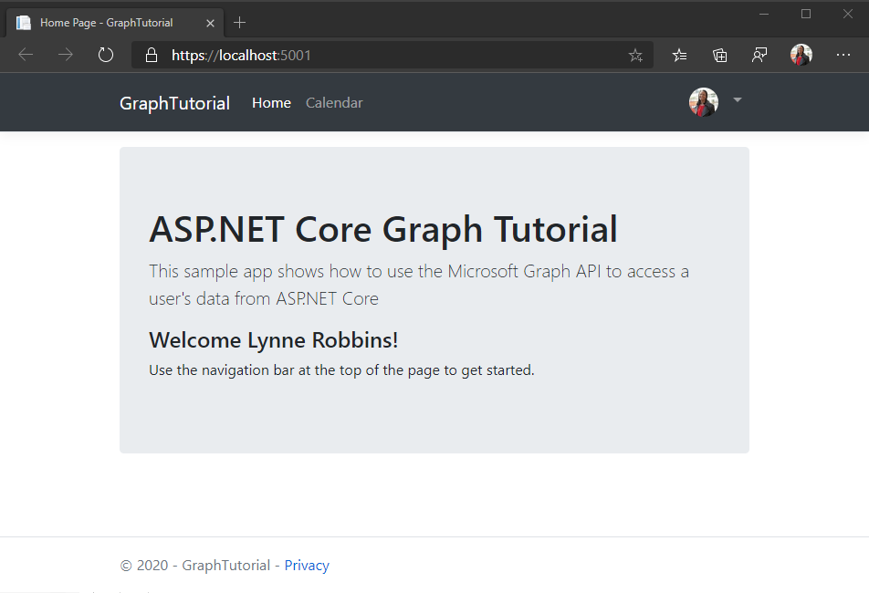

<!-- markdownlint-disable MD002 MD041 -->

In dieser Übung erweitern Sie die Anwendung aus der vorherigen Übung, um die Authentifizierung mit Azure AD zu unterstützen. Dies ist notwendig, um das erforderliche OAuth-Zugriffstoken zum Aufruf der Microsoft Graph-API abzurufen. In diesem Schritt wird die [Microsoft. Identity.](https://www.nuget.org/packages/Microsoft.Identity.Web/) webbibliothek konfiguriert.

> [!IMPORTANT]
> Um zu vermeiden, dass die Anwendungs-ID und der geheime Schlüssel in der Quelle gespeichert werden, verwenden Sie den [.net Secret Manager](/aspnet/core/security/app-secrets) zum Speichern dieser Werte. Der geheime Manager dient nur Entwicklungszwecken, für Produktions-apps sollte ein vertrauenswürdiger geheimer geheim Manager zum Speichern von Geheimnissen verwendet werden.

1. Öffnen Sie **./appsettings.jsauf** , und ersetzen Sie den Inhalt durch Folgendes.

    :::code language="json" source="../demo/GraphTutorial/appsettings.json" highlight="2-6":::

1. Öffnen Sie die CLI in dem Verzeichnis, in dem sich **GraphTutorial. csproj** befindet, und führen Sie die folgenden Befehle aus, indem `YOUR_APP_ID` Sie Ihre Anwendungs-ID aus dem Azure-Portal und den `YOUR_APP_SECRET` geheimen Anwendungsschlüssel ersetzen.

    ```Shell
    dotnet user-secrets init
    dotnet user-secrets set "AzureAd:ClientId" "YOUR_APP_ID"
    dotnet user-secrets set "AzureAd:ClientSecret" "YOUR_APP_SECRET"
    ```

## <a name="implement-sign-in"></a>Implementieren der Anmeldung

Beginnen Sie mit dem Hinzufügen der Microsoft Identity Platform-Dienste zur Anwendung.

1. Erstellen Sie eine neue Datei mit dem Namen **GraphConstants.cs** im Verzeichnis **./Graph** , und fügen Sie den folgenden Code hinzu.

    :::code language="csharp" source="../demo/GraphTutorial/Graph/GraphConstants.cs" id="GraphConstantsSnippet":::

1. Öffnen Sie die Datei **./Startup.cs** , und fügen Sie die folgenden `using` Anweisungen am Anfang der Datei hinzu.

    ```csharp
    using Microsoft.AspNetCore.Authentication.OpenIdConnect;
    using Microsoft.AspNetCore.Authorization;
    using Microsoft.AspNetCore.Mvc.Authorization;
    using Microsoft.Identity.Web;
    using Microsoft.Identity.Web.UI;
    using Microsoft.IdentityModel.Protocols.OpenIdConnect;
    using Microsoft.Graph;
    using System.Net;
    using System.Net.Http.Headers;
    ```

1. Ersetzen Sie die vorhandene `ConfigureServices`-Funktion durch Folgendes.

    ```csharp
    public void ConfigureServices(IServiceCollection services)
    {
        services
            // Use OpenId authentication
            .AddAuthentication(OpenIdConnectDefaults.AuthenticationScheme)
            // Specify this is a web app and needs auth code flow
            .AddMicrosoftIdentityWebApp(Configuration)
            // Add ability to call web API (Graph)
            // and get access tokens
            .EnableTokenAcquisitionToCallDownstreamApi(options => {
                Configuration.Bind("AzureAd", options);
            }, GraphConstants.Scopes)
            // Use in-memory token cache
            // See https://github.com/AzureAD/microsoft-identity-web/wiki/token-cache-serialization
            .AddInMemoryTokenCaches();

        // Require authentication
        services.AddControllersWithViews(options =>
        {
            var policy = new AuthorizationPolicyBuilder()
                .RequireAuthenticatedUser()
                .Build();
            options.Filters.Add(new AuthorizeFilter(policy));
        })
        // Add the Microsoft Identity UI pages for signin/out
        .AddMicrosoftIdentityUI();
    }
    ```

1. `Configure`Fügen Sie in der-Funktion die folgende Linie oberhalb der `app.UseAuthorization();` Linie hinzu.

    ```csharp
    app.UseAuthentication();
    ```

1. Öffnen Sie **./Controllers/HomeController.cs** , und ersetzen Sie den Inhalt durch Folgendes.

    ```csharp
    using GraphTutorial.Models;
    using Microsoft.AspNetCore.Authorization;
    using Microsoft.AspNetCore.Mvc;
    using Microsoft.Extensions.Logging;
    using Microsoft.Identity.Web;
    using System.Diagnostics;
    using System.Threading.Tasks;

    namespace GraphTutorial.Controllers
    {
        public class HomeController : Controller
        {
            ITokenAcquisition _tokenAcquisition;
            private readonly ILogger<HomeController> _logger;

            // Get the ITokenAcquisition interface via
            // dependency injection
            public HomeController(
                ITokenAcquisition tokenAcquisition,
                ILogger<HomeController> logger)
            {
                _tokenAcquisition = tokenAcquisition;
                _logger = logger;
            }

            public async Task<IActionResult> Index()
            {
                // TEMPORARY
                // Get the token and display it
                try
                {
                    string token = await _tokenAcquisition
                        .GetAccessTokenForUserAsync(GraphConstants.Scopes);
                    return View().WithInfo("Token acquired", token);
                }
                catch (MicrosoftIdentityWebChallengeUserException)
                {
                    return Challenge();
                }
            }

            public IActionResult Privacy()
            {
                return View();
            }

            [ResponseCache(Duration = 0, Location = ResponseCacheLocation.None, NoStore = true)]
            public IActionResult Error()
            {
                return View(new ErrorViewModel { RequestId = Activity.Current?.Id ?? HttpContext.TraceIdentifier });
            }

            [ResponseCache(Duration = 0, Location = ResponseCacheLocation.None, NoStore = true)]
            [AllowAnonymous]
            public IActionResult ErrorWithMessage(string message, string debug)
            {
                return View("Index").WithError(message, debug);
            }
        }
    }
    ```

1. Speichern Sie Ihre Änderungen und starten Sie das Projekt. Melden Sie sich mit Ihrem Microsoft-Konto an.

1. Überprüfen Sie die Zustimmungsaufforderung. Die Liste der Berechtigungen entspricht der Liste der Berechtigungs Bereiche, die in **./Graph/GraphConstants.cs** konfiguriert sind.

    - **Verwalten des Zugriffs auf Daten, denen Sie Zugriff geschenkt haben:** ( `offline_access` ) diese Berechtigung wird von MSAL angefordert, um Aktualisierungstoken abzurufen.
    - **Melden Sie sich an und lesen Sie Ihr Profil:** ( `User.Read` ) mit dieser Berechtigung kann die APP das Profil-und Profilfoto des angemeldeten Benutzers abrufen.
    - **Lesen der Postfacheinstellungen:** ( `MailboxSettings.Read` ) mit dieser Berechtigung kann die APP die Postfacheinstellungen des Benutzers lesen, einschließlich der Zeitzone und des Zeitformats.
    - **Vollen Zugriff auf Ihre Kalender haben:** ( `Calendars.ReadWrite` ) mit dieser Berechtigung kann die APP Ereignisse im Kalender des Benutzers lesen, neue Ereignisse hinzufügen und vorhandene ändern.

    

    Weitere Informationen zur Zustimmung finden Sie unter [Understanding Azure AD Application Einwilligung Experiences](/azure/active-directory/develop/application-consent-experience).

1. Zustimmung zu den angeforderten Berechtigungen. Der Browser leitet zur App um, in der Sie das Token sehen.

### <a name="get-user-details"></a>Benutzerdetails abrufen

Sobald sich der Benutzer angemeldet hat, können Sie dessen Informationen über Microsoft Graph abrufen.

1. Öffnen Sie **/Graph/GraphClaimsPrincipalExtensions.cs** , und ersetzen Sie den gesamten Inhalt durch Folgendes.

    :::code language="csharp" source="../demo/GraphTutorial/Graph/GraphClaimsPrincipalExtensions.cs" id="GraphClaimsExtensionsSnippet":::

1. Öffnen Sie **./Startup.cs** , und ersetzen Sie die vorhandene `.AddMicrosoftIdentityWebApp(Configuration)` Codezeile durch den folgenden Code.

    :::code language="csharp" source="../demo/GraphTutorial/Startup.cs" id="AddSignInSnippet":::

    Überprüfen Sie die Funktionsweise dieses Codes.

    - Es fügt einen Ereignishandler für das `OnTokenValidated` Ereignis hinzu.
        - Es verwendet die `ITokenAcquisition` Schnittstelle, um ein Zugriffstoken abzurufen.
        - Microsoft Graph wird aufgerufen, um das Benutzerprofil und das Foto zu erhalten.
        - Die Diagramm Informationen werden der Identität des Benutzers hinzugefügt.

1. Fügen Sie den folgenden Funktionsaufruf nach dem `EnableTokenAcquisitionToCallDownstreamApi` Aufruf und vor dem `AddInMemoryTokenCaches` Aufruf hinzu.

    :::code language="csharp" source="../demo/GraphTutorial/Startup.cs" id="AddGraphClientSnippet":::

    Dadurch wird ein authentifizierter **GraphServiceClient** für Controller über Dependency Injection verfügbar gemacht.

1. Öffnen Sie **./Controllers/HomeController.cs** , und ersetzen Sie die `Index` Funktion durch Folgendes.

    ```csharp
    public IActionResult Index()
    {
        return View();
    }
    ```

1. Entfernen Sie alle Verweise auf `ITokenAcquisition` in der **HomeController** -Klasse.

1. Speichern Sie Ihre Änderungen, starten Sie die APP, und durchlaufen Sie den Anmeldevorgang. Sie sollten wieder auf der Startseite enden, aber die Benutzeroberfläche sollte sich ändern, um anzugeben, dass Sie angemeldet sind.

    

1. Klicken Sie in der oberen rechten Ecke auf den Avatar des Benutzers, um auf den **Abmelde** Link zuzugreifen. Wenn Sie auf **Abmelden** klicken, wird die Sitzung zurückgesetzt und Sie kehren zur Startseite zurück.

    

## <a name="storing-and-refreshing-tokens"></a>Speichern und Aktualisieren von Token

Zu diesem Zeitpunkt verfügt Ihre Anwendung über ein Zugriffstoken, das in der `Authorization` Kopfzeile von API-aufrufen gesendet wird. Dies ist das Token, durch das die App im Namen des Benutzers auf Microsoft Graph zugreifen kann.

Dieses Token ist jedoch nur kurzzeitig verfügbar. Das Token läuft eine Stunde nach seiner Ausgabe ab. An dieser Stelle kommt das Aktualisierungstoken ins Spiel. Anhand des Aktualisierungstoken ist die App in der Lage, ein neues Zugriffstoken anzufordern, ohne dass der Benutzer sich erneut anmelden muss.

Da die APP die Microsoft. Identity. webbibliothek verwendet, müssen Sie keine Token-Speicher-oder Aktualisierungslogik implementieren.

Die APP verwendet den in-Memory-Token-Cache, der für apps ausreicht, die beim Neustart der APP keine Token beibehälten müssen. In Produktions-apps werden stattdessen möglicherweise die Optionen für den [verteilten Cache](https://github.com/AzureAD/microsoft-identity-web/wiki/token-cache-serialization) in der Microsoft. Identity. webbibliothek verwendet.

Die `GetAccessTokenForUserAsync` -Methode behandelt Token-Ablauf und-Aktualisierung für Sie. Zunächst wird das zwischengespeicherte Token überprüft, und wenn es nicht abgelaufen ist, wird es zurückgegeben. Wenn er abgelaufen ist, wird das zwischengespeicherte Aktualisierungstoken verwendet, um ein neues zu erhalten.

Die **GraphServiceClient** , die von Controllern über die Abhängigkeitsinjektion abgerufen werden, werden mit einem Authentifizierungsanbieter vorkonfiguriert, der `GetAccessTokenForUserAsync` für Sie verwendet wird.
