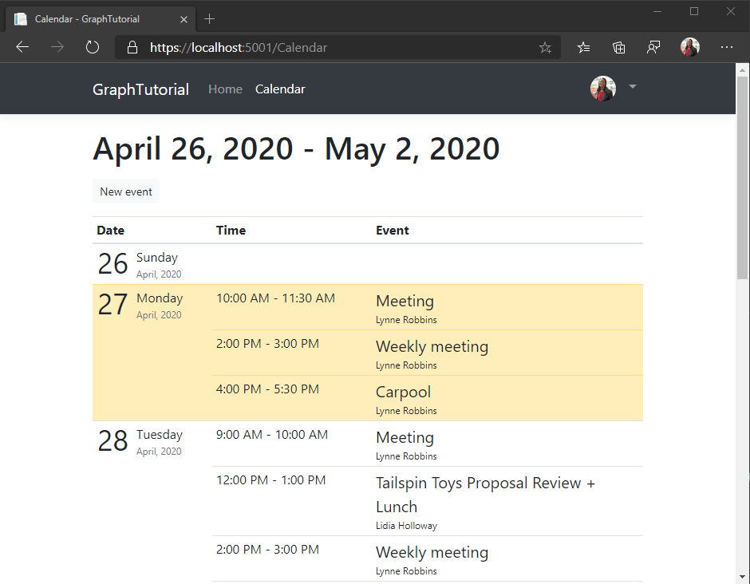

<!-- markdownlint-disable MD002 MD041 -->

<span data-ttu-id="3021c-101">In diesem Abschnitt werden Sie Microsoft Graph in die Anwendung integrieren.</span><span class="sxs-lookup"><span data-stu-id="3021c-101">In this section you will incorporate Microsoft Graph into the application.</span></span> <span data-ttu-id="3021c-102">Für diese Anwendung verwenden Sie die [Microsoft Graph-Clientbibliothek für .net](https://github.com/microsoftgraph/msgraph-sdk-dotnet) , um Anrufe an Microsoft Graph zu tätigen.</span><span class="sxs-lookup"><span data-stu-id="3021c-102">For this application, you will use the [Microsoft Graph Client Library for .NET](https://github.com/microsoftgraph/msgraph-sdk-dotnet) to make calls to Microsoft Graph.</span></span>

## <a name="get-calendar-events-from-outlook"></a><span data-ttu-id="3021c-103">Abrufen von Kalenderereignissen von Outlook</span><span class="sxs-lookup"><span data-stu-id="3021c-103">Get calendar events from Outlook</span></span>

<span data-ttu-id="3021c-104">Erstellen Sie zunächst einen neuen Controller für Kalenderansichten.</span><span class="sxs-lookup"><span data-stu-id="3021c-104">Start by creating a new controller for calendar views.</span></span>

1. <span data-ttu-id="3021c-105">Fügen Sie im Verzeichnis **./Controllers** eine neue Datei mit dem Namen **CalendarController.cs** hinzu, und fügen Sie den folgenden Code hinzu.</span><span class="sxs-lookup"><span data-stu-id="3021c-105">Add a new file named **CalendarController.cs** in the **./Controllers** directory and add the following code.</span></span>

    ```csharp
    using GraphTutorial.Models;
    using Microsoft.AspNetCore.Mvc;
    using Microsoft.Extensions.Logging;
    using Microsoft.Identity.Web;
    using Microsoft.Graph;
    using System;
    using System.Collections.Generic;
    using System.Threading.Tasks;
    using TimeZoneConverter;

    namespace GraphTutorial.Controllers
    {
        public class CalendarController : Controller
        {
            private readonly GraphServiceClient _graphClient;
            private readonly ILogger<HomeController> _logger;

            public CalendarController(
                GraphServiceClient graphClient,
                ILogger<HomeController> logger)
            {
                _graphClient = graphClient;
                _logger = logger;
            }
        }
    }
    ```

1. <span data-ttu-id="3021c-106">Fügen Sie der Klasse die folgenden Funktionen hinzu `CalendarController` , um die Kalenderansicht des Benutzers abzurufen.</span><span class="sxs-lookup"><span data-stu-id="3021c-106">Add the following functions to the `CalendarController` class to get the user's calendar view.</span></span>

    :::code language="csharp" source="../demo/GraphTutorial/Controllers/CalendarController.cs" id="GetCalendarViewSnippet":::

    <span data-ttu-id="3021c-107">Überprüfen Sie, was der Code in `GetUserWeekCalendar` ausführt.</span><span class="sxs-lookup"><span data-stu-id="3021c-107">Consider what the code in `GetUserWeekCalendar` does.</span></span>

    - <span data-ttu-id="3021c-108">Es verwendet die Zeitzone des Benutzers, um UTC-Start-und-End-Datum/-Uhrzeitwerte für die Woche abzurufen.</span><span class="sxs-lookup"><span data-stu-id="3021c-108">It uses the user's time zone to get UTC start and end date/time values for the week.</span></span>
    - <span data-ttu-id="3021c-109">Er fragt die [Kalenderansicht](/graph/api/calendar-list-calendarview?view=graph-rest-1.0) des Benutzers ab, um alle Ereignisse abzurufen, die zwischen den Start-und Enddatum/-Zeiten liegen.</span><span class="sxs-lookup"><span data-stu-id="3021c-109">It queries the user's [calendar view](/graph/api/calendar-list-calendarview?view=graph-rest-1.0) to get all events that fall between the start and end date/times.</span></span> <span data-ttu-id="3021c-110">Das Verwenden einer Kalenderansicht anstelle von [Ereignislisten](/graph/api/user-list-events?view=graph-rest-1.0) erweitert wiederkehrende Ereignisse und gibt alle Vorkommen zurück, die im angegebenen Zeitfenster vorkommen.</span><span class="sxs-lookup"><span data-stu-id="3021c-110">Using a calendar view instead of [listing events](/graph/api/user-list-events?view=graph-rest-1.0) expands recurring events, returning any occurrences that happen in the specified time window.</span></span>
    - <span data-ttu-id="3021c-111">Es verwendet die `Prefer: outlook.timezone` Kopfzeile, um Ergebnisse zurück in der Zeitzone des Benutzers abzurufen.</span><span class="sxs-lookup"><span data-stu-id="3021c-111">It uses the `Prefer: outlook.timezone` header to get results back in the user's timezone.</span></span>
    - <span data-ttu-id="3021c-112">Es wird verwendet `Select` , um die Felder einzuschränken, die auf nur die von der APP verwendeten zurückkommen.</span><span class="sxs-lookup"><span data-stu-id="3021c-112">It uses `Select` to limit the fields that come back to just those used by the app.</span></span>
    - <span data-ttu-id="3021c-113">Sie verwendet `OrderBy` , um die Ergebnisse chronologisch zu sortieren.</span><span class="sxs-lookup"><span data-stu-id="3021c-113">It uses `OrderBy` to sort the results chronologically.</span></span>
    - <span data-ttu-id="3021c-114">Es verwendet ein `PageIterator` to- [Page durch die Events-Auflistung](/graph/sdks/paging).</span><span class="sxs-lookup"><span data-stu-id="3021c-114">It uses a `PageIterator` to [page through the events collection](/graph/sdks/paging).</span></span> <span data-ttu-id="3021c-115">Dadurch wird der Fall behandelt, in dem der Benutzer über mehr Ereignisse in seinem Kalender verfügt als die angeforderte Seitengröße.</span><span class="sxs-lookup"><span data-stu-id="3021c-115">This handles the case where the user has more events on their calendar than the requested page size.</span></span>

1. <span data-ttu-id="3021c-116">Fügen Sie die folgende Funktion zur `CalendarController` -Klasse hinzu, um eine temporäre Ansicht der zurückgegebenen Daten zu implementieren.</span><span class="sxs-lookup"><span data-stu-id="3021c-116">Add the following function to the `CalendarController` class to implement a temporary view of the returned data.</span></span>

    ```csharp
    // Minimum permission scope needed for this view
    [AuthorizeForScopes(Scopes = new[] { "Calendars.Read" })]
    public async Task<IActionResult> Index()
    {
        try
        {
            var userTimeZone = TZConvert.GetTimeZoneInfo(
                User.GetUserGraphTimeZone());
            var startOfWeek = CalendarController.GetUtcStartOfWeekInTimeZone(
                DateTime.Today, userTimeZone);

            var events = await GetUserWeekCalendar(startOfWeek);

            // Return a JSON dump of events
            return new ContentResult {
                Content = _graphClient.HttpProvider.Serializer.SerializeObject(events),
                ContentType = "application/json"
            };
        }
        catch (ServiceException ex)
        {
            if (ex.InnerException is MicrosoftIdentityWebChallengeUserException)
            {
                throw ex;
            }

            return new ContentResult {
                Content = $"Error getting calendar view: {ex.Message}",
                ContentType = "text/plain"
            };
        }
    }
    ```

1. <span data-ttu-id="3021c-117">Starten Sie die App, melden Sie sich an, und klicken Sie auf den Link **Kalender** in der Navigationsleiste.</span><span class="sxs-lookup"><span data-stu-id="3021c-117">Start the app, sign in, and click the **Calendar** link in the nav bar.</span></span> <span data-ttu-id="3021c-118">Wenn alles funktioniert, sollte ein JSON-Abbild von Ereignissen im Kalender des Benutzers angezeigt werden.</span><span class="sxs-lookup"><span data-stu-id="3021c-118">If everything works, you should see a JSON dump of events on the user's calendar.</span></span>

## <a name="display-the-results"></a><span data-ttu-id="3021c-119">Anzeigen der Ergebnisse</span><span class="sxs-lookup"><span data-stu-id="3021c-119">Display the results</span></span>

<span data-ttu-id="3021c-120">Jetzt können Sie eine Ansicht hinzufügen, um die Ergebnisse benutzerfreundlicher anzuzeigen.</span><span class="sxs-lookup"><span data-stu-id="3021c-120">Now you can add a view to display the results in a more user-friendly manner.</span></span>

### <a name="create-view-models"></a><span data-ttu-id="3021c-121">Erstellen von ansichtsmodellen</span><span class="sxs-lookup"><span data-stu-id="3021c-121">Create view models</span></span>

1. <span data-ttu-id="3021c-122">Erstellen Sie eine neue Datei mit dem Namen **CalendarViewEvent.cs** im Verzeichnis **./Models** , und fügen Sie den folgenden Code hinzu.</span><span class="sxs-lookup"><span data-stu-id="3021c-122">Create a new file named **CalendarViewEvent.cs** in the **./Models** directory and add the following code.</span></span>

    :::code language="csharp" source="../demo/GraphTutorial/Models/CalendarViewEvent.cs" id="CalendarViewEventSnippet":::

1. <span data-ttu-id="3021c-123">Erstellen Sie eine neue Datei mit dem Namen **DailyViewModel.cs** im Verzeichnis **./Models** , und fügen Sie den folgenden Code hinzu.</span><span class="sxs-lookup"><span data-stu-id="3021c-123">Create a new file named **DailyViewModel.cs** in the **./Models** directory and add the following code.</span></span>

    :::code language="csharp" source="../demo/GraphTutorial/Models/DailyViewModel.cs" id="DailyViewModelSnippet":::

1. <span data-ttu-id="3021c-124">Erstellen Sie eine neue Datei mit dem Namen **CalendarViewModel.cs** im Verzeichnis **./Models** , und fügen Sie den folgenden Code hinzu.</span><span class="sxs-lookup"><span data-stu-id="3021c-124">Create a new file named **CalendarViewModel.cs** in the **./Models** directory and add the following code.</span></span>

    :::code language="csharp" source="../demo/GraphTutorial/Models/CalendarViewModel.cs" id="CalendarViewModelSnippet":::

### <a name="create-views"></a><span data-ttu-id="3021c-125">Erstellen von Ansichten</span><span class="sxs-lookup"><span data-stu-id="3021c-125">Create views</span></span>

1. <span data-ttu-id="3021c-126">Erstellen Sie ein neues Verzeichnis namens **Calendar** im Verzeichnis **./views** .</span><span class="sxs-lookup"><span data-stu-id="3021c-126">Create a new directory named **Calendar** in the **./Views** directory.</span></span>

1. <span data-ttu-id="3021c-127">Erstellen Sie eine neue Datei mit dem Namen **_DailyEventsPartial. cshtml** im Verzeichnis **./views/Calendar** , und fügen Sie den folgenden Code hinzu.</span><span class="sxs-lookup"><span data-stu-id="3021c-127">Create a new file named **_DailyEventsPartial.cshtml** in the **./Views/Calendar** directory and add the following code.</span></span>

    :::code language="cshtml" source="../demo/GraphTutorial/Views/Calendar/_DailyEventsPartial.cshtml" id="DailyEventsPartialSnippet":::

1. <span data-ttu-id="3021c-128">Erstellen Sie eine neue Datei mit dem Namen **Index. cshtml** im Verzeichnis **./views/Calendar** , und fügen Sie den folgenden Code hinzu.</span><span class="sxs-lookup"><span data-stu-id="3021c-128">Create a new file named **Index.cshtml** in the **./Views/Calendar** directory and add the following code.</span></span>

    :::code language="cshtml" source="../demo/GraphTutorial/Views/Calendar/Index.cshtml" id="CalendarIndexSnippet":::

### <a name="update-calendar-controller"></a><span data-ttu-id="3021c-129">Kalender Controller aktualisieren</span><span class="sxs-lookup"><span data-stu-id="3021c-129">Update calendar controller</span></span>

1. <span data-ttu-id="3021c-130">Öffnen Sie **./Controllers/CalendarController.cs** , und ersetzen Sie die vorhandene `Index` Funktion durch Folgendes.</span><span class="sxs-lookup"><span data-stu-id="3021c-130">Open **./Controllers/CalendarController.cs** and replace the existing `Index` function with the following.</span></span>

    :::code language="csharp" source="../demo/GraphTutorial/Controllers/CalendarController.cs" id="IndexSnippet":::

1. <span data-ttu-id="3021c-131">Starten Sie die App, melden Sie sich an, und klicken Sie auf den Link **Kalender**.</span><span class="sxs-lookup"><span data-stu-id="3021c-131">Start the app, sign in, and click the **Calendar** link.</span></span> <span data-ttu-id="3021c-132">Die App sollte nun eine Tabelle mit Ereignissen rendern.</span><span class="sxs-lookup"><span data-stu-id="3021c-132">The app should now render a table of events.</span></span>

    
