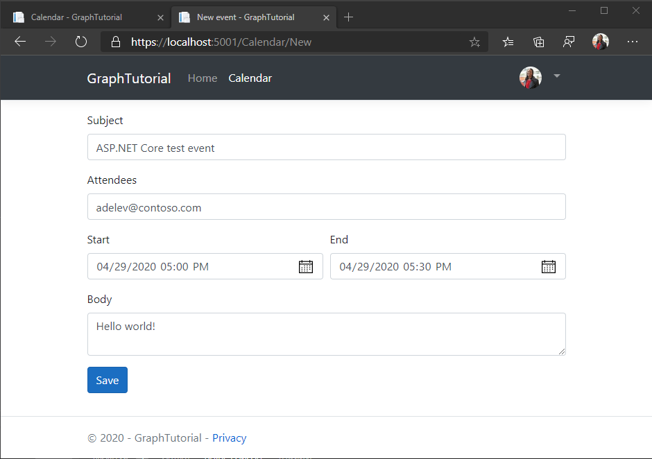

<!-- markdownlint-disable MD002 MD041 -->

In diesem Abschnitt können Sie die Möglichkeit zum Erstellen von Ereignissen im Kalender des Benutzers hinzufügen.In this section you will add the ability to create events on the user's calendar.

## Modell erstellenCreate model

1. Erstellen Sie eine neue Datei mit dem Namen **NewEvent.cs** im Verzeichnis **./Models** , und fügen Sie den folgenden Code hinzu.Create a new file named **NewEvent.cs** in the **./Models** directory and add the following code.

    :::code language="csharp" source="../demo/GraphTutorial/Models/NewEvent.cs" id="NewEventSnippet":::

## Ansicht erstellenCreate view

1. Erstellen Sie eine neue Datei namens " **New. cshtml** " im Verzeichnis "He **./views/Calendar** ", und fügen Sie den folgenden Code hinzu.Create a new file named **New.cshtml** in he **./Views/Calendar** directory and add the following code.

    :::code language="cshtml" source="../demo/GraphTutorial/Views/Calendar/New.cshtml" id="NewFormSnippet":::

## Hinzufügen von controlleraktionenAdd controller actions

1. Öffnen Sie **/Controllers/CalendarController.cs** , und fügen Sie der Klasse die folgende Aktion hinzu `CalendarController` , um das neue Ereignis Formular zu rendern.Open **./Controllers/CalendarController.cs** and add the following action to the `CalendarController` class to render the new event form.

    :::code language="csharp" source="../demo/GraphTutorial/Controllers/CalendarController.cs" id="CalendarNewGetSnippet":::

1. Fügen Sie der Klasse die folgende Aktion hinzu, `CalendarController` um das neue Ereignis aus dem Formular zu erhalten, wenn der Benutzer auf **Speichern** klickt und Microsoft Graph verwendet, um das Ereignis dem Kalender des Benutzers hinzuzufügen.Add the following action to the `CalendarController` class to receive the new event from the form when the user clicks **Save** and use Microsoft Graph to add the event to the user's calendar.

    :::code language="csharp" source="../demo/GraphTutorial/Controllers/CalendarController.cs" id="CalendarNewPostSnippet":::

1. Starten Sie die App, melden Sie sich an, und klicken Sie auf den Link **Kalender**.Start the app, sign in, and click the **Calendar** link. Klicken Sie auf die Schaltfläche **Neues Ereignis** , füllen Sie das Formular aus, und klicken Sie auf **Speichern**.Click the **New event** button, fill in the form, and click **Save**.

    
